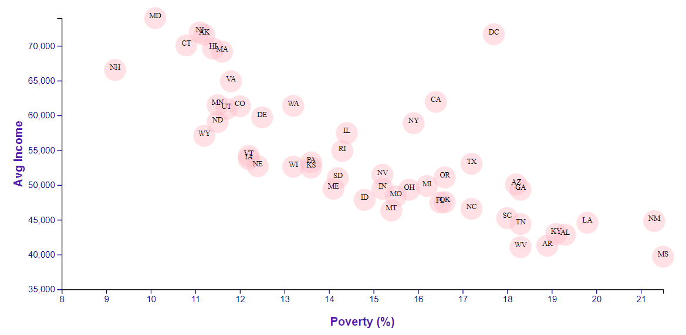

# Data Journalism and D3

## Background

Welcome to the newsroom! You've just accepted a data visualization position for a major metro paper. You're tasked with analyzing the current trends shaping people's lives, as well as creating charts, graphs, and interactive elements to help readers understand your findings.

The editor wants to run a series of feature stories about the health risks facing particular demographics. She's counting on you to sniff out the first story idea by sifting through information from the U.S. Census Bureau and the Behavioral Risk Factor Surveillance System.

The data set included with the assignment is based on 2014 ACS 1-year estimates from the [US Census Bureau](https://data.census.gov/cedsci/), but you are free to investigate a different data set. The current data set includes data on rates of income, obesity, poverty, etc. by state. MOE stands for "margin of error."

## My First Task

I created a static scatter plot between `Household Income vs. Poverty`.

Using the D3 techniques, this scatter plot represents each state with circle elements. I coded this graphic in the `app.js` file of this github repository and pulled in the data from `healthData.csv` by using the `d3.csv` function. My scatter plot appear like the image at the top of this section.

Note that I Included state abbreviations in the circles.

### My Second Task

#### 1. More Data, More Dynamics

I included more demographics and more risk factors. I placed additional labels in the scatter plot and gave them click events so that users can decide which data to display. I animated the transitions for circles' locations as well as the range of axes. 

#### 2. Incorporate d3-tip

While the ticks on the axes allow us to infer approximate values for each circle, it's impossible to determine the true value without adding another layer of data. Therefore, I entered tooltips: these allow users to check specific element's data when they hover their cursor over the element. Example:

- - -
Contact info:
maercoli2017@gmail.com

